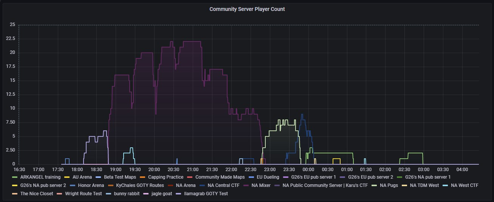

# tribes-exporter
Exports prometheus stats about the tribes community.

| Stat | Description |
| --- | --- |
|`player_count{server="<server_name>"}` | Number of players in each community server (ta.kfk4ever.com)

Currently updates every minute.

## Build
```

docker build . -t tribes-exporter

docker buildx build --platform linux/arm64,linux/amd64 --tag <registry/>tribes-exporter --push .
```

## Run
```
docker run -P tribes-exporter
```

## Prometheus
```
  - job_name: 'tribes-exporter'
    metrics_path: '/api/v1/metrics'
    params:
      format: [prometheus]
    honor_labels: true
    static_configs:
      - targets: ['tribes-exporter:8080']
```

Example Query:
```
sum by(server) (player_count)
```

